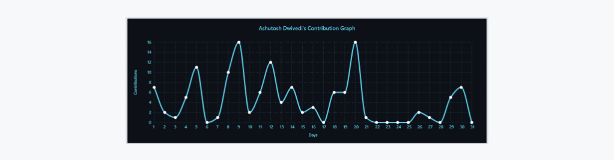

<h1 align="center">Github Readme Activity Graph</h1>

<h5 align="center">Fonte: <a href="https://github.com/Ashutosh00710/github-readme-activity-graph">github.com/Ashutosh00710/github-readme-activity-graph</a> </h5>

## O que é?

O **GitHub Readme Activity Graph** é uma ferramenta que permite adicionar um gráfico de atividades diretamente no seu Profile README no GitHub. Esse gráfico visualiza suas contribuições ao longo do tempo, facilitando a análise de padrões de contribuição e engajamento em projetos.

## Recursos Principais
- **Visualização de Contribuições:** Mostra um gráfico colorido que destaca suas atividades no GitHub, como commits, pull requests, e issues.
- **Customização:** Você pode personalizar cores e o período de tempo que o gráfico exibe.
- **Atualização Automática:** O gráfico é atualizado automaticamente para refletir suas atividades mais recentes.

theme=**react-dark**


## Como usar

Basta colar o seguinte URL.

**Adicione `username` no URL**

```md
[](https://github.com/ashutosh00710/github-readme-activity-graph)
```

## Temas

_`username=ashutosh00710&theme=theme_name`_

```md
[](https://github.com/ashutosh00710/github-readme-activity-graph)
```
